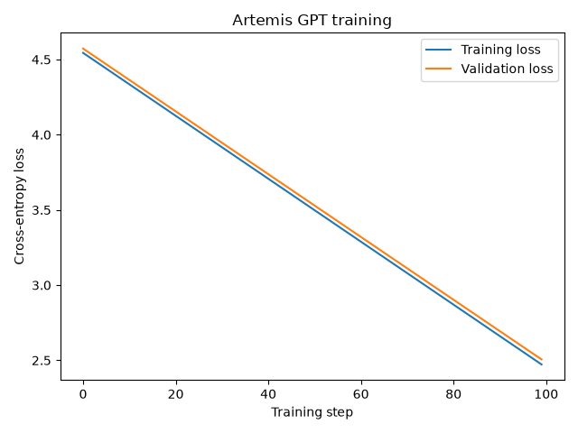

# Artemis GPT

A small character-level GPT written in PyTorch and trained on Artemis-program text.

This began as my own implementation of attention heads and Transformer blocks. I used Codex to help refine the incomplete parts into a runnable project while keeping the design simple.

## How to run it?

```powershell
python -m pip install -r requirements.txt
python main.py
```

Training creates two useful files:

- `artemis_gpt.pt` - the saved model checkpoint.
- `training_metrics.png` - a plot of training and validation loss.

After training once, run this quick demo without training again:

```powershell
python demo.py
```

The program generates Artemis-style text from the saved checkpoint.

## Traning Metrics.
Example plot of training and validation loss.



## Files

- `attention_head.py` contains the attention head, Transformer block, and GPT model.
- `tokenizer.py` converts characters to numerical tokens and back.
- `config.py` holds the few training settings.
- `main.py` loads the data, trains the model, saves the checkpoint, and creates the loss plot.
- `demo.py` loads the saved model and generates text.
